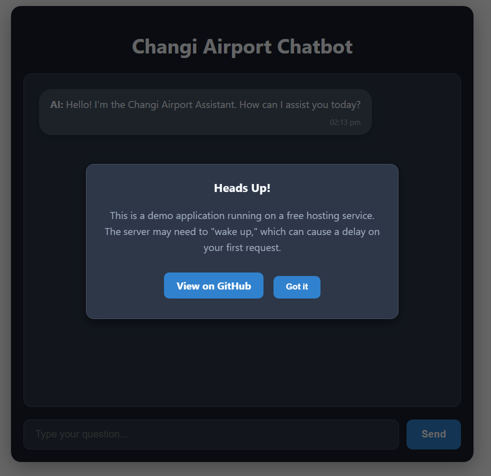
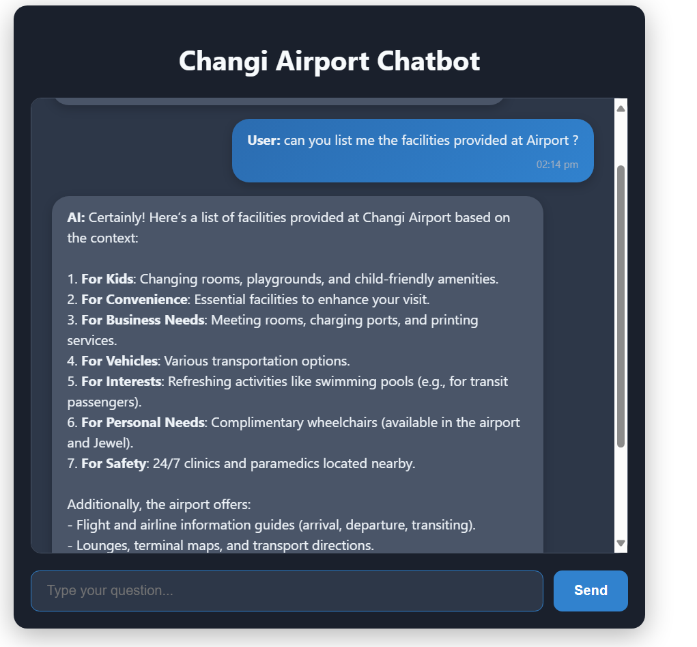

# Changi Airport RAG Chatbot

An intelligent, full-stack chatbot designed to provide real-time answers about Singapore's Changi Airport. This application is powered by a Retrieval-Augmented Generation (RAG) pipeline that uses scraped data from official airport websites(https://www.changiairport.com/in/en.html) (https://www.jewelchangiairport.com/en.html), Pinecone vector database for efficient retrieval, and a powerful Hugging Face LLM for generation. The entire app is served through a responsive React UI.

- Live Frontend: https://changi-chatbot.netlify.app (Being Hosted Free it may take time to generate first response)
- Live Backend API: https://changi-bot.onrender.com/health

## Project Architecture & Flow

```
Websites → Scraper → Cleaned JSON Data
              ↓
Jupyter Notebook (vectors_pinecone.ipynb)
              ↓
    Chunking → Embeddings → Pinecone Index
              ↓
       User Query (React UI)
              ↓
      FastAPI Backend API
              ↓
Rewrite Query & Retrieve Context (in parallel)
              ↓
     Prompt Construction (LLM)
              ↓
  Hugging Face Model Response
              ↓
        Displayed in UI
```

## Folder Structure

```
RAG-CHATBOT/
├── rag-chatbot-ui/      # React Frontend Application
│   ├── public/
│   └── src/
│       └── App.js       # Main UI component
├── scraper/             # Python scripts for web scraping
│   ├── link_scraper.py
│   └── content_scraper.py
├── vectors/             # Notebook for embedding generation
│   └── vectors_pinecone.ipynb
├── data/                # Holds scraped and cleaned data
├── .env                 # Secret API keys (local only)
├── .gitignore           # Specifies files for Git to ignore
├── rag_api.py           # FastAPI backend server
├── rag_chatbot.py       # Core RAG logic
└── requirements.txt     # Python dependencies
```

## Data Pipeline: From Web to Knowledge Base

### 1. Discover All Links

Run the link scraper to collect all crawlable URLs from Changi and Jewel websites:

```bash
python scraper/link_scraper.py
```

- Output: `data/all_discovered_links.json`

### 2. Scrape and Clean Content

Visit each URL and extract clean text (excluding navbars, footers, etc.):

```bash
python scraper/content_scraper.py
```

- Output: `data/changi_jewel_cleaned.json`

### 3. Generate Embeddings and Upload to Pinecone

Run the notebook to:

- Load cleaned JSON data  
- Chunk the content  
- Convert text to embeddings using `BAAI/bge-base-en-v1.5`  
- Upload to Pinecone

Run: `vectors/vectors_pinecone.ipynb`

## Technology Stack

| Component         | Choice                         | Reason |
|------------------|--------------------------------|--------|
| Frontend          | React                          | Modern, fast, SPA architecture |
| Backend           | FastAPI                        | Async, high performance |
| Embedding Model   | BAAI/bge-base-en-v1.5          | Top-tier semantic performance |
| Vector DB         | Pinecone                       | Fast, serverless vector search |
| LLM               | deepseek-ai/DeepSeek-V3        | Strong reasoning & instruction-following |
| Hosting           | Netlify + Render               | Best-in-class static + backend hosting |

## How to Run Locally

### 1. Clone and Set Up Backend

```bash
git clone https://github.com/bilalahmad0210/Changi_Bot.git
cd Changi_Bot

python -m venv env
env\Scripts\activate  # or source env/bin/activate on macOS/Linux

pip install -r requirements.txt
```

Create a `.env` file with your keys:

```env
PINECONE_API_KEY="your_key"
HUGGINGFACE_API_KEY="your_key"
```

### 2. Set Up Frontend

```bash
cd rag-chatbot-ui
npm install
```

### 3. Launch the Application

Terminal 1 (Backend):

```bash
uvicorn rag_api:app --reload
```

Terminal 2 (Frontend):

```bash
npm start
```

- Backend runs at: http://localhost:8000  
- Frontend runs at: http://localhost:3000

## Screenshots

| Notification Popup | Chat Interface |
|----------------|--------------------|
|  |  |

## Author

Built by Bilal Ahmad  
LinkedIn: https://linkedin.com/in/bilalahmad0210  
Email: bilalahmad0210@gmail.com

## License

MIT License - free to use, modify, and distribute.
